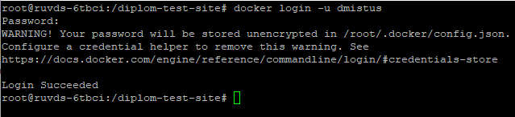
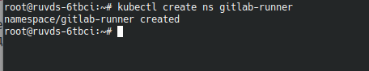

# Дипломный практикум в Yandex.Cloud

Проверим готовность машины:

Terraform v1.5.5
Ansible 2.16.6
Python 3.11.2
Docker 26.1.4
Git 2.39.2
Kubectl v1.29.2
Helm v3.14.3
Yandex Cloud CLI 0.124.0


### Создание облачной инфраструктуры
 Создам сервисный аккаунт с необходимыми правами для работы с облачной инфраструктурой:

```
# Создаем сервисный аккаунт для Terraform
resource "yandex_iam_service_account" "service" {
  folder_id = var.folder_id
  name      = var.account_name
}

# Выдаем роль editor сервисному аккаунту Terraform
resource "yandex_resourcemanager_folder_iam_member" "service_editor" {
  folder_id = var.folder_id
  role      = "editor"
  member    = "serviceAccount:${yandex_iam_service_account.service.id}"
}
```

2. Подготавливаю backend для Terraform. Использовать буду S3-bucket:

```
# Создаем статический ключ доступа для сервисного аккаунта
resource "yandex_iam_service_account_static_access_key" "terraform_service_account_key" {
  service_account_id = yandex_iam_service_account.service.id
}

# Используем ключ доступа для создания бакета
resource "yandex_storage_bucket" "tf-bucket" {
  bucket     = "for-state2"
  access_key = yandex_iam_service_account_static_access_key.terraform_service_account_key.access_key
  secret_key = yandex_iam_service_account_static_access_key.terraform_service_account_key.secret_key

  anonymous_access_flags {
    read = false
    list = false
  }

  force_destroy = true

provisioner "local-exec" {
  command = "echo export AWS_ACCESS_KEY=${yandex_iam_service_account_static_access_key.terraform_service_account_key.access_key} > ../terraform/backend.tfvars"
}

provisioner "local-exec" {
  command = "echo export AWS_SECRET_KEY=${yandex_iam_service_account_static_access_key.terraform_service_account_key.secret_key} >> ../terraform/backend.tfvars"
}
}
```
Применим код:

Проверим, создался ли S3-bucket и сервисный аккаунт:


После создания S3-bucket, выполним настройку для его использования в качестве backend для Terraform. 

```
terraform {
  backend "s3" {
    endpoint = "storage.yandexcloud.net"
    bucket = "for-state"
    region = "ru-central1"
    key = "for-state/terraform.tfstate"
    skip_region_validation = true
    skip_credentials_validation = true
  }
}
```

 
 Задам параметры для доступа к S3 хранилищус помощью переменных окружения:
 


Создим VPC с подсетями в разных зонах доступности:

```
resource "yandex_vpc_network" "diplom" {
  name = var.vpc_name
}
resource "yandex_vpc_subnet" "diplom-subnet1" {
  name           = var.subnet1
  zone           = var.zone1
  network_id     = yandex_vpc_network.diplom.id
  v4_cidr_blocks = var.cidr1
}

resource "yandex_vpc_subnet" "diplom-subnet2" {
  name           = var.subnet2
  zone           = var.zone2
  network_id     = yandex_vpc_network.diplom.id
  v4_cidr_blocks = var.cidr2
}

variable "zone1" {
  type        = string
  default     = "ru-central1-a"
  description = "https://cloud.yandex.ru/docs/overview/concepts/geo-scope"
}

variable "zone2" {
  type        = string
  default     = "ru-central1-b"
  description = "https://cloud.yandex.ru/docs/overview/concepts/geo-scope"
}

variable "cidr1" {
  type        = list(string)
  default     = ["10.0.1.0/24"]
  description = "https://cloud.yandex.ru/docs/vpc/operations/subnet-create"
}

variable "cidr2" {
  type        = list(string)
  default     = ["10.0.2.0/24"]
  description = "https://cloud.yandex.ru/docs/vpc/operations/subnet-create"
}

variable "vpc_name" {
  type        = string
  default     = "diplom"
  description = "VPC network&subnet name"
}

variable "bucket_name" {
  type        = string
  default     = "ft-state"
  description = "VPC network&subnet name"
}

variable "subnet1" {
  type        = string
  default     = "diplom-subnet1"
  description = "subnet name"
}

variable "subnet2" {
  type        = string
  default     = "diplom-subnet2"
  description = "subnet name"
}
```

Напишем код Terraform для создания виртуальных машин для Kubernetes кластера. Будут использоваться одна Master ноду и две Worker ноды.
Для проверки правильности кода используем команду terraform validate.

Иницилизируем Terraform.


Применим код.


Проверим, создались ли виртуальные машины:


Проверим удаление созданных ресурсов:


Настрим автоматическое применение, удаление и обновление кода Terraform. Для этого воспользуемся GitHub Actions. Напишем Workflow, который позволит запускать применение и удаление кода Terraform по условиям через события workflow_dispatch. При нажатии на кнопку Run workflow, условие true запустит создание инфраструктуры, условие true запустит её удаление:


## Создание Kubernetes кластера


Склонируем репозиторий на свою рабочую машину.


Для разворачивания облачной инфраструктуры с помощью Terraform применим следующий код:

```
resource "local_file" "hosts_cfg_kubespray" {
  content  = templatefile("${path.module}/hosts.tftpl", {
    workers = yandex_compute_instance.worker
    masters = yandex_compute_instance.master
  })
  filename = "../../kubespray/inventory/mycluster/hosts.yaml"
}
```

Код по пути /kubespray/inventory/mycluster/ создаст файл hosts.yaml и по шаблону автоматически заполнит его ip адресами нод.

Сам файл шаблона выглядит следующим образом:

```
all:
  hosts:%{ for idx, master in masters }
    master:
      ansible_host: ${master.network_interface[0].nat_ip_address}
      ip: ${master.network_interface[0].ip_address}
      access_ip: ${master.network_interface[0].nat_ip_address}%{ endfor }%{ for idx, worker in workers }
    worker-${idx + 1}:
      ansible_host: ${worker.network_interface[0].nat_ip_address}
      ip: ${worker.network_interface[0].ip_address}
      access_ip: ${worker.network_interface[0].nat_ip_address}%{ endfor }
  children:
    kube_control_plane:
      hosts:%{ for idx, master in masters }
        ${master.name}:%{ endfor }
    kube_node:
      hosts:%{ for idx, worker in workers }
        ${worker.name}:%{ endfor }
    etcd:
      hosts:%{ for idx, master in masters }
        ${master.name}:%{ endfor }~
    k8s_cluster:
      children:
        kube_control_plane:
        kube_node:
    calico_rr:
      hosts: {}
```

Запустим установку kubernetes кластера командой 
```
ansible-playbook -i inventory/mycluster/hosts.yaml -u ubuntu --become --become-user=root --private-key=~/.ssh/id_rsa -e 'ansible_ssh_common_args="-o StrictHostKeyChecking=no"' cluster.yml --flush-cache
```


Спустя некоторое время установка Kubernetes кластера методом Kubespray завершена:


Создаем конфигурационный файл кластера Kubernetes:

Создадим директорию для хранения файла конфигурации, скопируем созданный при установке Kubernetes кластера конфигурационный файл в созданную директорию.


Назначим права для пользователя на директорию и файл конфигурации.


Проверим доступность подов и нод кластера:


Поды и ноды кластера доступны и находятся в состоянии готовности, следовательно развёртывание Kubernetes кластера успешно завершено.


### Создание тестового приложения


Создим отдельный репозиторий для тестового приложения:


Cклонируем репозиторий на свою рабочую машину:


Создим статичную страничку, которая будет показывать картинку и текст:


Сделаем коммит и отправим созданную страницу в репозиторий.


Напишем Dockerfile, который создаст контейнер с nginx и отобразит созданную страницу:


Авторизуюсь в Docker Hub:




Создим Docker образ:


Проверим, создался ли образ:


Образ создан.

Опубликуем созданный образ реестре Docker Hub:


Проверим наличие образа в реестре Docker Hub:


Сгенерируем  сертификат:


```
ubuntu@master:~$ sudo kubeadm init phase certs apiserver --apiserver-cert-extra-sans 10.233.0.1,10.10.1.5 --apiserver-cert-extra-sans 62.84.126.90 --apiserver-cert-extra-sans localhost
I0926 14:20:00.205699   37543 version.go:256] remote version is much newer: v1.31.0; falling back to: stable-1.30
[certs] Generating "apiserver" certificate and key
[certs] apiserver serving cert is signed for DNS names [kubernetes kubernetes.default kubernetes.default.svc kubernetes.default.svc.cluster.local localhost master] and IPs [10.96.0.1 10.0.1.22 10.233.0.1 10.10.1.5 62.84.126.90]

```

Скопируем конфигурационный файл на рабочую машину :


Проверим доступность кластера:


Kubernetes кластер доступен с рабочей машины.

Добавим репозиторий prometheus-community для его установки с помощью helm:


Для доступа к Grafana снаружи кластера Kubernetes будем использовать тип сервиса NodePort.

Используем Helm и подготовленный файл значений values.yaml и выполним установку prometheus-community:


При установке был создан отдельный Namespace с названием monitoring.

Проверим результат установки:


Откроем web-интерфейс Grafana:


Авторизуемся в Grafana с заранее заданным в values.yaml паролем:


Авторизация проходит успешно, данные о состоянии кластера отображаются на дашбордах:


Приступим к развёртыванию тестового приложения на Kubernetes кластере.

Создадим отдельный Namespace, в котором будем разворачивать тестовое приложение:


Напишем манифест Deployment с тестовым приложением:


Применим манифест Deployment и проверю результат:


Deployment создан и запущен.

Напишем манифест сервиса с типом NodePort для доступа к web-интерфейсу тестового приложения:


Применим манифест сервиса и проверю результат:


Сервис создан. проверим доступ к приложению извне:


#### Установка и настройка CI/CD

Для организации процессов CI/CD будем использовать GitLab.

Создадим в GitLab новый пустой проект с именем diplom-test-site.


Отправим созданную ранее статичную страницу и Dockerfile из старого репозитория GitHub в новый проект на GitLab:


Для автоматизации процесса CI/CD нам понадобится  GitLab Runner, который будет выполнять задачи, указанные в файле .gitlab-ci.yml.

На странице настроек проекта в разделе подключения GitLab Runner создадим Runner. Указанные на странице данные нам понадобятся для регистрации и аутентификации Runner'а в проекте.


Выполним подготовку Kubernetes кластера к установке GitLab Runner'а. Создадим отдельный Namespace, в котором будет располагаться GitLab Runner и создим Kubernetes secret, который будет использоваться для регистрации установленного в дальнейшем GitLab Runner:

```
kubectl create ns gitlab-runner

kubectl --namespace=gitlab-runner create secret generic runner-secret --from-literal=runner-registration-token="<token>" --from-literal=runner-token=""
```



Нам понадобится подготовить файл значений values.yaml, для того, чтобы указать в нем количество Runners, время проверки наличия новых задач, настройка логирования, набор правил для доступа к ресурсам Kubernetes, ограничения на ресурсы процессора и памяти.

Приступим к установке GitLab Runner. Устанавливать будем используя Helm:

```
helm repo add gitlab https://charts.gitlab.io

helm install gitlab-runner gitlab/gitlab-runner -n gitlab-runner -f helm-runner/values.yaml

```


Проверим результат установки:


GitLab Runner установлен и запущен. 

Проверим через web-интерфейс, подключился ли GitLab Runner к GitLab репозиторию:


Подключение GitLab Runner к репозиторию GitLab завершено.

Для выполнения GitLab CI/CD Pipeline нам понадобится в настройках созданного проекта в разделе Variables указать переменные:


В переменных мы указали адрес реестра Docker Hub, данные для авторизации в нем, а также имя собираемого образа и конфигурационный файл Kubernetes для доступа к развёрнутому выше кластеру. Для большей безопасности конфигурационный файл Kubernetes размести в формате base64. Также часть переменных будет указана в самом файле .gitlab-ci.yml.

Напишем конфигурайионный файл .gitlab-ci.yml для автоматической сборки docker image и деплоя приложения при изменении кода.

Pipeline будет разделен на две стадии: 1. На первой стадии (build) будет происходить авторизация в Docker Hub, сборка образа и его публикация в реестре Docker Hub. Сборка образа будет происходить только для main ветки и только в GitLab Runner с тегом diplom. Сам процесс сборки происходит следующим образом - если при git push указан тег, то Docker образ будет создан именно с этим тегом. Если при git push тэг не указывать, то Docker образ будет собран с тегом latest'. Поскольку мне не удалось запустить Docker-in-Dpcker в GitLab Rinner и я получал ошибку доступа к docker.socket, сборка будет происходить на основе контейнераgcr.io/kaniko-project/executor:v1.22.0-debug.

На второй стадии (deploy) будет применяться конфигурационный файл для доступа к кластеру Kubernetes и манифесты из git репозитория. Также будет перезапущен Deployment методом rollout restart для применения обновленного приложение. Эта стадия выполняться только для ветки main и на GitLab Runner с тегом diplom и только при условии, что первая стадия build была выполнена успешно.

Проверим работу Pipeline. Исходная страница приложения:


Внесем в репозиторий изменения и отправлю из в Git с указанием тега.

Проверим, обновилась ли страница приложения:


Ссылки на Terr


